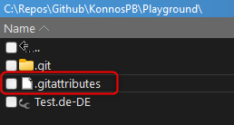

# XLF Git-Merge-Driver 

XLF oder [XLIFF](https://en.wikipedia.org/wiki/XLIFF) ist ein XML-basiertes Dateiformat für Übersetzungen und wird unter anderem auch mit Dynamics 365 Business Central verwendet.
Da ich häufiger vor dem Problem stand, große XLF-Dateien (ca. 30.000 Übersetzungen) zusammenzuführen, die von mehreren Personen parallel bearbeitet wurden, habe ich mich kurzerhand entschlossen, einen auf meine Bedürfnisse zugeschnittenen Git-Merge-Driver zu entwickeln. Der Treiber ist in Powershell geschrieben, da ich ihn ausschließlich im Microsoft-Umfeld einsetzen möchte.

## Wieso einen XLF Git-Merge-Driver?   
Der Git-Standard behandelt XLF-Dateien wie normale Textdateien, was zu unerwünschten Ergebnissen führt.

Ein einfaches Beispiel:   
Jemand fügt eine Übersetzung durch ein Trans-Unit-Abschnitt hinzu und committed diese Änderung in seinem Git-Branch.
``` Xml
<?xml version="1.0" encoding="utf-8"?>
<xliff version="1.2" xmlns="urn:oasis:names:tc:xliff:document:1.2" xmlns:xsi="http://www.w3.org/2001/XMLSchema-instance" xsi:schemaLocation="urn:oasis:names:tc:xliff:document:1.2 xliff-core-1.2-transitional.xsd">
  <file datatype="xml" source-language="en-US" target-language="de-DE" >
    <body>
      <group id="body" datatype="resx">
        <trans-unit id="ID1" size-unit="char" translate="yes" xml:space="preserve">
          <source>Original 1</source>
          <target state="translated">Translation 1</target>
        </trans-unit>     
      </group>
    </body>
  </file>
</xliff>
```

Zufälligerweise bearbeitet jemand anderes die Datei ebenfalls in einem anderen Git-Branch.   
Wichtig hier: Die verwendete Id des Trans-Unit-Elements ist eine andere (**ID2**).
``` Xml
<?xml version="1.0" encoding="utf-8"?>
<xliff version="1.2" xmlns="urn:oasis:names:tc:xliff:document:1.2" xmlns:xsi="http://www.w3.org/2001/XMLSchema-instance" xsi:schemaLocation="urn:oasis:names:tc:xliff:document:1.2 xliff-core-1.2-transitional.xsd">
  <file datatype="xml" source-language="en-US" target-language="de-DE" >
    <body>
      <group id="body" datatype="resx">
        <trans-unit id="ID2" size-unit="char" translate="yes" xml:space="preserve">
          <source>Original 2</source>
          <target state="translated">Translation 2</target>
        </trans-unit>     
      </group>
    </body>
  </file>
</xliff>
```

Wenn man nun die Git-Branches zusammenführen möchte, wird Git einen Konflikt melden, da Git nur einen Textvergleich durchführt.   
_In diesem sehr einfachen Beispiel ist das kein großes Problem und relativ einfach manuell zu lösen. Bei sehr vielen Einträgen sieht das schon anders aus._


Der XLF Git-Merge-Driver hingegen würde in diesem Beispiel beide Änderungen nacheinander anordnen, ohne eine Kollision zu melden.   
Also so:
``` Xml
<?xml version="1.0" encoding="utf-8"?>
<xliff version="1.2" xmlns="urn:oasis:names:tc:xliff:document:1.2" xmlns:xsi="http://www.w3.org/2001/XMLSchema-instance" xsi:schemaLocation="urn:oasis:names:tc:xliff:document:1.2 xliff-core-1.2-transitional.xsd">
  <file datatype="xml" source-language="en-US" target-language="de-DE" >
    <body>
      <group id="body" datatype="resx">
        <trans-unit id="ID1" size-unit="char" translate="yes" xml:space="preserve">
          <source>Original 1</source>
          <target state="translated">Translation 1</target>
        </trans-unit>  
        <trans-unit id="ID2" size-unit="char" translate="yes" xml:space="preserve">
          <source>Original 2</source>
          <target state="translated">Translation 2</target>
        </trans-unit>    
      </group>
    </body>
  </file>
</xliff>
```

## Konfliktbehandlung
Nun kann es trotz Berücksichtigung des XLF-Formats zu echten Konflikten kommen. 
Zum Beispiel, wenn eine Übersetzung in einem Git-Branch geändert wurde, während in einem anderen Git-Branch der Trans-Unit-Abschnitt mit derselben Id vollständig gelöscht wurde. In diesem Fall fragt der XLF Git-Merge-Driver den Anwender interaktiv.  
Das sieht dann zum Beispiel so aus.

```
Merging Test.de-DE.xlf
Conflict at trans-unit 'ID1'.
<<<<<<< ours:Test.de-DE.xlf modified
~  <trans-unit id="ID1" size-unit="char" translate="yes" xml:space="preserve" xmlns="urn:oasis:names:tc:xliff:document:1.2">
~      <source>Original1</source>
~      <target state="translated">###### Translation 1 Modified by User A ######</target>
~      <note from="Xliff Generator" annotates="general" priority="3">Table Test - Property Caption</note>
~  </trans-unit>
=======
~  <trans-unit id="ID1" size-unit="char" translate="yes" xml:space="preserve" xmlns="urn:oasis:names:tc:xliff:document:1.2">
~      <source>Original1</source>
~      <target state="translated">Translation 1 Modified by User B</target>
~      <note from="Xliff Generator" annotates="general" priority="3">Table Test - Property Caption</note>
~  </trans-unit>
>>>>>>> theirs:Test.de-DE.xlf modified

Enter (t)heirs, (o)urs or any other to (a)bort merging:
```
Entscheidet sich der Benutzer nun für "theirs", gibt er `t` + `enter` ein.

Wenn es mehrere Konflikte gibt, werden diese nacheinander angezeigt. 

Wird mit (a)bort abgebrochen, beendet sich das Powershell-Skript mit einem Exit-Code 1, der wiederum den Standard-Merge-Mechanismus aktiviert. Es besteht die Möglichkeit, den Git-Merge-Vorgang abzubrechen, um die Dateien in Ruhe ansehen zu können.


## Installation

### 1. XLF Git-Merge-Driver Powershell-Skript herunterladen.
Den aktuellen Stand des Script Merge-XlfDocuments.ps1 gibt es [hier](https://github.com/KonnosPB/xlf-git-merge-driver/blob/main/src/Merge-XlfDocuments.ps1).

### 2. Die Git-Konfigurationsdatei `.git/config` muss angepasst werden.


Hier muss eine Konfigurationssektion `merge` hinzugefügt werden, die das Powershell-Skript mit der korrekten Parametrisierung aufruft.

``` Dockerfile
[merge "xlf-merge-driver"]
	name = A custom XLF merge driver written in powershell used to resolve conflicts of xlf translation files.
	driver = powershell.exe -File '<path-to-Merge-XlfDocuments.ps1>' %O %A %B %P
```

Einige Hinweise zu nicht offensichtlichen Inhalten:
- `%O`= merge ancestor’s version  
- `%A`= current version  (ours / yours)
- `%B`= other branches' version (theirs)
- `%P`= merge ancestor’s version

Mehr Details zu `gitattributes` gibt es [hier](https://git-scm.com/docs/gitattributes)

### 3. Der dritte Schritt ist die Erstellung einer `.gitattributes` Datei im Wurzelverzeichnis.


Es muss lediglich eine Zeile hinzugefügt werden, die angibt, dass der XLF Git-Merge-Driver für bestimmte Dateiendungen aktiviert werden soll.

```
*.xlf merge=xlf-merge-driver
```

## Visual Studio Code und XLF Git-Merge-Driver
Leider verwendet Visual Studio Code einen eigenen Merge-Mechanismus und nicht den von Git mitgelieferten. Das bedeutet, dass Visual Studio Code den .gitattributes ignoriert. Zumindest war das bei meinen Test dies der Fall.   
Ich konnte das Problem umgehen, indem ich eine anderen, standardnäheren Git-Client wie z.B. [Git Extensions](https://gitextensions.github.io/) verwende, wenn eine xlf-Datei involviert ist oder ich führe das [Git-Merge](https://git-scm.com/docs/git-merge) Kommando im Terminal von Visual Studio aus.


## Pretty-Print Ausgabe

Einige Entwickler passen die XLF-Datei "manuell" an und verschieben dabei unbeabsichtigt die Einrückungen. Aus diesem Grund gibt der XLF Git-Merge-Treiber die Ausgabe Lese-optimiert mit Einrückung aus. Die Einrückungstiefe kann mit dem Parameter `XmlIndentation` geändert werden, der Standardwert ist 2.

Beispiel für die Erhöhung der Einrückungstiefe von 2 auf 4. Die Anpassung muss in der Datei `.git/config` vorgenommen werden:
```
[merge "xlf-merge-driver"]
	name = A custom XLF merge driver written in powershell used to resolve conflicts of xlf translation files.
	driver = powershell.exe -File '../xlf-git-merge-driver/src/Merge-XlfDocuments.ps1' %O %A %B %P -XmlIndentation 4
```  

## Einfache Gültigkeitsprüfung der Trans-Unit-Abschnitte
Gelegentlich kommt es vor, dass Entwickler Transunit-Abschnitte so ändern, dass zwar die XML-Struktur noch gültig ist, nicht aber das XLF-Dokument.
Dies kann z.B. passieren, wenn ein Transunit Abschnitt dupliziert wurde und eine Id mehrfach vorkommt. Klassischer Copy+Paste Fehler.   
Mit dem Parameter `CheckDocument` können die zu mergenden XLF-Dokumente vorab validiert werden. Folgende Prüfmöglichkeiten stehen zur Verfügung. `Both`, `Theirs`, `Ours`, `NoCheck`, wobei `Both` voreingestellt ist.

Beispiel, wenn keine Validierung des Transit-Unit-Abschnitte gewünscht wird. Die Anpassung muss in der Datei `.git/config` vorgenommen werden:

```
[merge "xlf-merge-driver"]
	name = A custom XLF merge driver written in powershell used to resolve conflicts of xlf translation files.
	driver = powershell.exe -File '../xlf-git-merge-driver/src/Merge-XlfDocuments.ps1' %O %A %B %P -CheckDocument NoCheck
```  